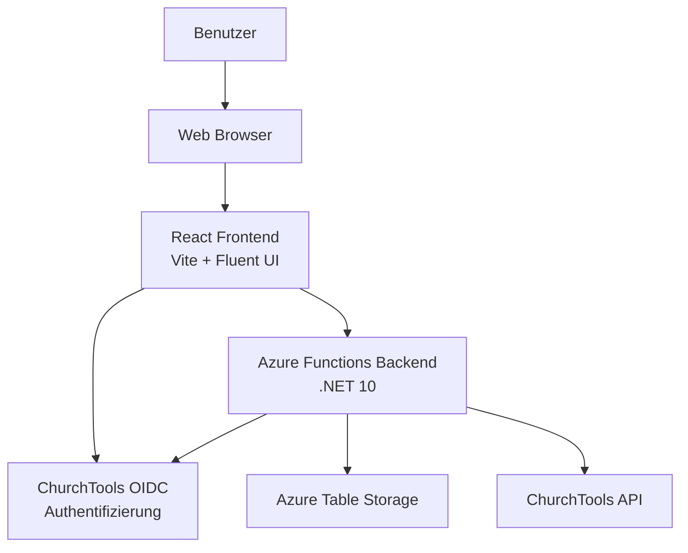
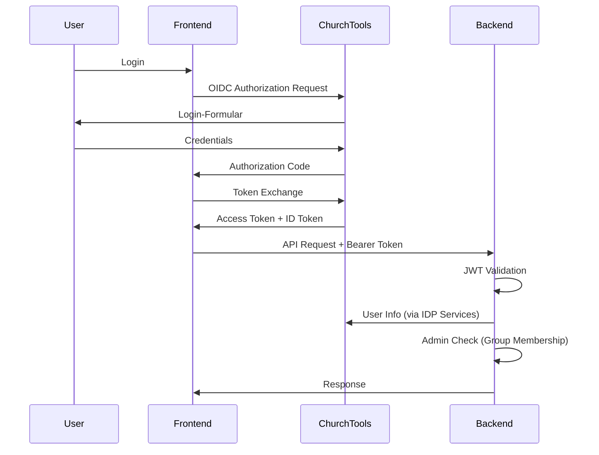

# System-Architektur

Diese Dokumentation beschreibt die Architektur des ChurchTool Service Survey Tools.

## Übersicht

Das System ist als moderne, Cloud-native Anwendung konzipiert mit klarer Trennung zwischen Frontend, Backend und Datenschicht.



## Komponenten

### 1. Frontend (React + Vite)

**Technologie-Stack:**
- React 19
- TypeScript
- Vite 8 (Build-Tool)
- Fluent UI 9 (Design System)
- TanStack Query (Server State Management)
- React Router 7 (Client-Side Routing)
- react-oidc-context (Authentifizierung)

**Hauptverantwortlichkeiten:**
- Benutzeroberfläche für Umfragen, Rückmeldungen und Einteilungen
- OIDC-Authentifizierung mit ChurchTools
- API-Kommunikation mit Backend
- Client-Side State Management

**Ordnerstruktur:**
```
packages/frontend/src/
├── components/    # Wiederverwendbare UI-Komponenten
├── pages/         # Seiten-Komponenten (Routing)
├── hooks/         # Custom React Hooks
├── services/api/  # API-Client-Layer
├── contexts/      # React Contexts (Auth, etc.)
├── config/        # Konfiguration (OIDC, API)
├── utils/         # Hilfsfunktionen
└── styles/        # CSS-Dateien
```

### 2. Backend (Azure Functions)

**Technologie-Stack:**
- .NET 10
- Azure Functions v4 (Isolated Worker Model)
- ASP.NET Core Integration
- Azure Table Storage SDK
- ChurchTools API Client (Fegmm.ChurchTools)
- Application Insights (Telemetrie)

**Hauptverantwortlichkeiten:**
- REST API für Frontend
- Geschäftslogik (Umfragen, Rückmeldungen, Einteilungen)
- JWT-Token-Validierung
- ChurchTools-Integration (User, Gruppen, Dienste)
- Datenpersistenz in Table Storage

**Ordnerstruktur:**
```
packages/backend/
├── Functions/     # HTTP-Trigger Functions
├── Services/      # Business-Logic-Services
├── Middleware/    # ASP.NET Core Middleware
├── Models/
│   ├── Dtos/      # Data Transfer Objects
│   └── Entities/  # Table Storage Entities
└── Tools/         # Build-Tools (DTO-Generator)
```

### 3. Shared Package

**Zweck:**
- Single Source of Truth für TypeScript-Typen
- Gemeinsame DTOs zwischen Frontend und Backend

**Prozess:**
1. C# DTOs im Backend definieren
2. Optional: TypeScript-Typen generieren (Tools/DtoTypeGenerator)
3. Frontend nutzt `@ct-service-survey/shared` als Dependency

### 4. Datenschicht (Azure Table Storage)

**Tabellen:**

| Tabelle | PartitionKey | RowKey | Beschreibung |
|---------|--------------|--------|---------------|
| **Surveys** | `"Survey"` | `{surveyId}` | Umfragen |
| **ServiceDates** | `{surveyId}` | `{serviceDateId}` | Termine pro Umfrage |
| **Responses** | `{surveyId}` | `{userId}` | Rückmeldungen pro User |
| **Assignments** | `{surveyId}` | `{assignmentId}` | Einteilungen |
| **Services** | `"Service"` | `{serviceId}` | Dienst-Definitionen |

**Partitioning-Strategie:**
- Surveys: Feste PartitionKey `"Survey"` für einfache Abfragen
- ServiceDates: Partitionierung nach `surveyId` für effiziente Abfrage pro Umfrage
- Responses: Partitionierung nach `surveyId` für effiziente Abfrage pro Umfrage
- Assignments: Partitionierung nach `surveyId` für effiziente Abfrage pro Umfrage

## Authentifizierung & Autorisierung

### OIDC-Flow



### Rollen

**Teamleiter (Admin):**
- Umfragen erstellen, bearbeiten, löschen
- Einteilungen vornehmen
- Alle Rückmeldungen sehen

**Mitarbeiter (User):**
- Eigene Rückmeldungen einreichen
- Umfragen anzeigen
- Eigene Einteilungen sehen

**Admin-Prüfung:**
- Backend prüft Gruppenmitgliedschaft via ChurchTools API
- Konfiguration: `CHURCHTOOL_ADMIN_GROUP_ID` in Environment-Variablen

## API-Struktur

### Endpunkt-Konventionen

**Public Endpoints:**
- `GET /api/me` - Current User
- `GET /api/surveys` - Liste aller Umfragen
- `GET /api/surveys/{id}` - Einzelne Umfrage
- `POST /api/surveys/{id}/responses` - Rückmeldung einreichen

**Admin Endpoints:**
- `POST /api/admin/surveys` - Umfrage erstellen
- `PUT /api/admin/surveys/{id}` - Umfrage aktualisieren
- `DELETE /api/admin/surveys/{id}` - Umfrage löschen
- `POST /api/admin/assignments` - Einteilungen erstellen

Siehe [API.md](API.md) für vollständige API-Dokumentation.

## Datenmodell

### Entitäten

**Survey (Umfrage):**
```typescript
interface SurveyDto {
  id: string;
  name: string;
  description?: string;
  createdBy: string;
  createdByName: string;
  status: SurveyStatus; // Draft | Active | Closed
  createdAt: string;
  updatedAt: string;
  dates: ServiceDateDto[];
}
```

**ServiceDate (Termin):**
```typescript
interface ServiceDateDto {
  id: string;
  surveyId: string;
  date: string;
  serviceType: string;
  serviceTypeName: string;
  requiredPeople: number;
  notes?: string;
}
```

**Response (Rückmeldung):**
```typescript
interface ResponseDto {
  id: string;
  surveyId: string;
  userId: string;
  userName: string;
  availability: ServiceDateAvailability[];
  submittedAt: string;
  updatedAt: string;
}
```

**Assignment (Einteilung):**
```typescript
interface AssignmentDto {
  id: string;
  serviceDateId: string;
  surveyId: string;
  userId: string;
  userName: string;
  serviceType: string;
  date: string;
  confirmedAt?: string;
  notes?: string;
  createdBy: string;
  createdAt: string;
}
```

## ChurchTools-Integration

### Genutzte APIs

**IDP Services:**
- Authentifizierung via OIDC
- User-Info (Name, E-Mail, Gruppen)
- Token-Validierung

**ChurchTools API:**
- Gruppen abrufen (für Admin-Check)
- Dienste abrufen (ServiceTypes)
- Optional: Mitarbeiter-Informationen

### Konfiguration

Environment-Variablen:
- `CHURCHTOOL_URL` - ChurchTools-Instanz
- `OIDC_AUTHORITY_URL` - OIDC-Provider
- `CHURCHTOOL_ADMIN_GROUP_ID` - Admin-Gruppe

## Deployment-Architektur (Azure)

```
Azure Resource Group
├── Static Web App (Frontend)
│   └── CDN Endpoint (optional)
├── Function App (Backend)
│   ├── App Service Plan (Consumption/Flex)
│   └── Application Insights
└── Storage Account
    ├── Table Storage (Daten)
    └── Blob Storage (optional, für Exports)
```

Siehe [DEPLOYMENT.md](DEPLOYMENT.md) für Details.

## Sicherheitsaspekte

### Authentifizierung
- OIDC via ChurchTools (OpenID Connect)
- JWT-Token-Validierung im Backend
- Keine Passwort-Speicherung in der Applikation

### Autorisierung
- Rollenbasierte Zugriffskontrolle (Teamleiter vs. Mitarbeiter)
- Backend-seitige Prüfung aller Berechtigungen
- User kann nur eigene Rückmeldungen bearbeiten

### Datenschutz
- Alle Daten in Azure Table Storage verschlüsselt
- HTTPS für alle Kommunikation
- CORS-Konfiguration auf Frontend-Domain beschränkt

### API-Sicherheit
- Alle Endpunkte (außer Health) erfordern Authentifizierung
- JWT-Token-Validierung via ASP.NET Core Middleware
- Rate Limiting (geplant)

## Performance-Überlegungen

### Frontend
- Code Splitting via React Router
- Lazy Loading von Komponenten
- TanStack Query für Caching (5 Min. staleTime)
- Optimistic Updates für bessere UX

### Backend
- Azure Functions Consumption/Flex Plan
- Table Storage für schnelle NoSQL-Abfragen
- Application Insights für Performance-Monitoring
- Keyed DI für effiziente Table-Client-Wiederverwendung

### Skalierung
- Frontend: Statisches Hosting, global über CDN
- Backend: Auto-Scaling via Azure Functions
- Daten: Table Storage skaliert automatisch

## Monitoring & Logging

- **Application Insights** für Backend-Telemetrie
- **Console Logging** im Frontend (Entwicklung)
- **Structured Logging** im Backend (.NET ILogger)
- Health-Endpoint für Verfügbarkeitsüberwachung

## Weitere Ressourcen

- [Setup-Anleitung](SETUP.md)
- [API-Dokumentation](API.md)
- [Deployment-Guide](DEPLOYMENT.md)
